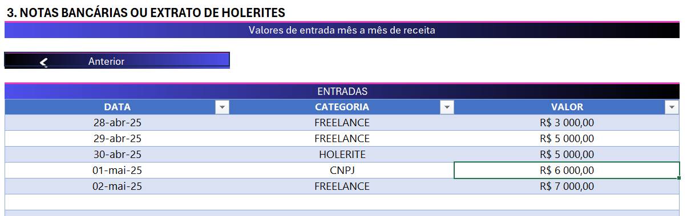

# Simulador de Declaração de Imposto de Renda

Este projeto é uma planilha interativa desenvolvida para auxiliar no preenchimento e simulação da declaração do Imposto de Renda para pessoas físicas. É especialmente útil para controlar e visualizar rendimentos, informes bancários e valores recebidos mensalmente.

## Funcionalidades

- **Apresentação do Projeto**: Introdução ao objetivo da planilha e seu uso como simulador.
- **Dados do Titular**: Espaço dedicado ao preenchimento dos dados pessoais do contribuinte.
- **Informes de Rendimentos**: Permite o lançamento de valores recebidos por instituições financeiras.
- **Notas Bancárias / Holerites**: Seção para controle de receitas mensais por período.
- **Lista de Bancos de Apoio**: Relação de bancos com seus respectivos códigos para facilitar o preenchimento dos informes.

## Estrutura da Planilha

- `Inicio`: Introdução e objetivos do simulador.
- `Titular`: Coleta de dados como nome, CPF, etc.
- `Informes`: Preenchimento dos rendimentos bancários por instituição.
- `Notas`: Entradas mensais de receitas.
- `Bancos de Apoio`: Lista com códigos e nomes dos principais bancos brasileiros.

## Como Usar

1. Abra o arquivo `.xlsx` no Excel ou no Google Sheets.
2. Vá até a aba `Titular` e preencha seus dados pessoais.
3. Em `Informes`, registre os valores de rendimentos de cada banco.
4. Use a aba `Notas` para registrar entradas mensais.
5. Consulte a aba `Bancos de Apoio` para inserir corretamente os códigos e nomes dos bancos.

## Requisitos

- Microsoft Excel 2016 ou superior
- (Opcional) Google Sheets com suporte a validação de dados

## Preview da Planilha

## Contribuições

Contribuições são bem-vindas! Se você tiver sugestões de melhorias, correções ou quiser adicionar novas funcionalidades à planilha:

1. Faça um fork do repositório.
2. Crie uma branch com sua feature: `git checkout -b minha-feature`.
3. Commit suas alterações: `git commit -m 'Adiciona nova feature'`.
4. Push para a branch: `git push origin minha-feature`.
5. Abra um Pull Request.
